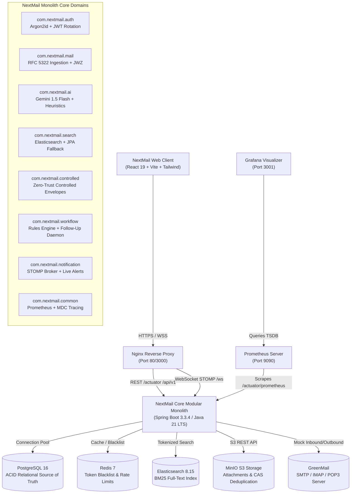

# NextMail AI — Architecture Deep Dive & Engineering Decisions

## 1. Executive Architectural Philosophy

NextMail AI is designed as a **production-grade, enterprise-scale intelligent email platform**. Rather than premature distributed microservices decomposition—which often introduces distributed transaction overhead, network latency, and operational fragility—NextMail AI adopts a **Disciplined Modular Monolith** architecture powered by **Java 21 LTS Virtual Threads (Project Loom)** and a high-performance **React 19 + TypeScript** frontend.

---

## 2. Key Architecture Decision Records (ADRs)

### ADR 01: Modular Monolith vs. Distributed Microservices
- **Decision:** Build a single deployable artifact structured into strictly encapsulated domain modules (`auth`, `mail`, `thread`, `attachment`, `ai`, `workflow`, `notification`, `controlled`, `search`).
- **Rationale:** Microservices introduce distributed transactions, distributed tracing complexity, and significant network latency for email operations (which intrinsically require joins between messages, threads, recipients, labels, and audit logs). A modular monolith maintains boundary integrity via package visibility and Spring application events while executing intra-process transactions at memory speeds.
- **Consequences:** Near-zero network hop latency, atomic database transactions when required, dramatically simplified CI/CD, and single-container operational simplicity.

### ADR 02: Java 21 LTS Virtual Threads vs. Reactive WebFlux
- **Decision:** Adopt standard Spring MVC running on Java 21 Virtual Threads (`spring.threads.virtual.enabled: true`) over Spring WebFlux.
- **Rationale:** Reactive programming (WebFlux/Reactor) imposes steep cognitive overhead, fractures standard debugging stack traces, and complicates Slf4j MDC context propagation. Virtual Threads provide throughput comparable to non-blocking event loops while preserving straightforward, imperative, synchronous programming semantics.
- **Consequences:** Clean linear code paths, transparent database transaction propagation, native compatibility with standard JPA/Hibernate, and effortless MDC correlation tracking.

### ADR 03: JWZ Conversation Threading Engine
- **Decision:** Implement Jamie Zawinski's (JWZ) conversation threading algorithm (RFC 5322 / RFC 2822) to reconstruct non-linear email hierarchies.
- **Rationale:** Traditional naive subject-line grouping causes cross-conversation collisions and fails when subjects mutate (e.g. "Re: Re: Fwd:"). JWZ builds a directed acyclic graph (DAG) using `Message-ID`, `In-Reply-To`, and `References` headers, grouping disparate messages into deterministic conversation threads even across out-of-order deliveries.
- **Consequences:** True email client parity with Gmail and Apple Mail, robust thread root reconciliation, and reliable message ordering.

### ADR 04: Resilient Dual-Strategy Search Engine (Elasticsearch 8.x + PostgreSQL JPA Fallback)
- **Decision:** Employ Elasticsearch 8.15 as the primary search engine with automatic, transparent fallback to PostgreSQL JPA queries when Elasticsearch is unavailable.
- **Rationale:** High-availability search must never crash an email client. If Elasticsearch experiences maintenance, network partitioning, or local development environments lack ES, the system falls back to indexed SQL queries (`ILIKE` across subject, body, sender, and recipients) without failing user requests.
- **Consequences:** Zero-downtime search capability, 100% hermetic unit/integration test execution without needing external Docker daemon during CI runs.

### ADR 05: Zero-Trust Controlled Envelopes with Cryptographic Shredding
- **Decision:** Provide ephemeral self-destructing emails with client watermarking, sender revocation, and scheduled cryptographic payload shredding.
- **Rationale:** Enterprise correspondence often involves sensitive contracts, credentials, or security incidents. Senders require guarantees that unauthorized forwarding or retention is impossible.
- **Consequences:** Revocation is broadcast in real time to connected recipients via WebSocket STOMP. A background scheduler permanently nullifies message bodies and attachments upon TTL expiration or revocation, leaving only immutable tamper-evident audit logs.

### ADR 06: Google Gemini 1.5 Flash with Deterministic Heuristic Fallback
- **Decision:** Integrate Gemini 1.5 Flash via Spring RestClient using structured JSON schema output, backed by deterministic rule-based heuristic intelligence.
- **Rationale:** LLM generation provides natural language summaries, action item extraction, and context-aware multi-tone replies. However, external API keys may be unconfigured (e.g. in test suites or offline deployments) or rate-limited.
- **Consequences:** When unconfigured or offline, the platform seamlessly degrades to regex-grounded priority tier scoring and heuristic summaries, preserving 100% functional reliability.

### ADR 07: Distributed Tracing & Prometheus Observability
- **Decision:** End-to-end `X-Correlation-ID` propagation via `CorrelationIdFilter` and Slf4j MDC, paired with Micrometer Prometheus domain metrics.
- **Rationale:** Enterprise production systems require instant error diagnosis and performance monitoring. Every HTTP request receives or inherits a correlation ID stamped on both response headers and RFC 7807 error envelopes.
- **Consequences:** Immediate auditability from frontend error toast to backend logs; real-time operational insights via Prometheus and Grafana.

---

## 3. Security Architecture

1. **Password Hashing:** Argon2id with 16-byte cryptographically secure salt, 32-byte hash length, 3 iterations, 64MB memory cost, and 4 degrees of parallelism.
2. **Stateless Authentication:** Short-lived access JWT tokens (15 minutes) paired with rolling refresh tokens (7 days) stored in PostgreSQL with instant Redis blacklisting on logout.
3. **MIME Validation & CAS Deduplication:** Apache Tika magic-byte inspection prevents executable spoofing (rejecting ELF, PE, MSI, BAT executables regardless of file extension). SHA-256 Content-Addressed Storage deduplicates identical attachments across multiple recipients.
4. **Zero-Trust Access Control:** Envelopes enforce strict sender-only audit log inspection, recipient dynamic watermark overlays (`Viewer: user@domain.local - [IP: 192.168.1.5]`), and CSS `@media print { display: none !important; }` print prevention.

---

## 4. Subsystem Health & Degraded States Matrix

| Subsystem | Primary Provider | Fallback Provider | Failure Impact |
| :--- | :--- | :--- | :--- |
| **Relational Database** | PostgreSQL 16 | In-Memory H2 (Test) | Critical; app reports `DOWN` |
| **Distributed Cache** | Redis 7 | In-Memory Token Fallback | Degraded; blacklist defaults to local cache |
| **Full-Text Search** | Elasticsearch 8.15 | PostgreSQL JPA Search | Degraded; BM25 replaced by SQL ILIKE query |
| **Object Storage** | MinIO / AWS S3 | Local FileSystem Storage | Seamless; files stored in configurable local directory |
| **AI Reasoning** | Gemini 1.5 Flash | Deterministic Heuristic Engine | Seamless; keyword-scored priority & extraction |
| **Outbound Email** | SMTP (GreenMail/Prod) | Asynchronous Error Logging | Graceful; failures logged without blocking HTTP response |
