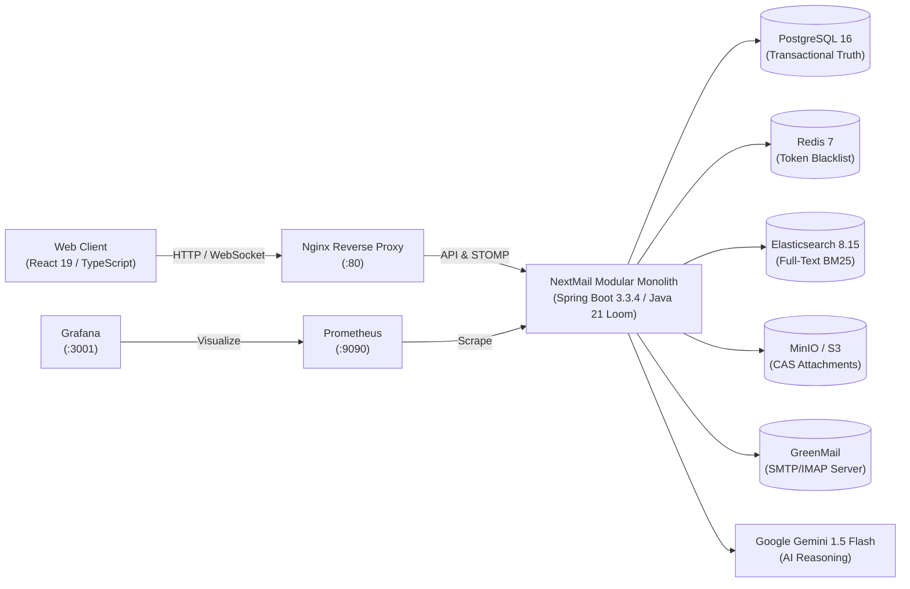

# NextMail AI — Next-Generation Intelligent Email Platform

[](https://openjdk.org/projects/jdk/21/)
[](https://spring.io/projects/spring-boot)
[](https://react.dev/)
[](https://www.typescriptlang.org/)
[](https://www.postgresql.org/)
[](https://www.elastic.co/)
[](https://prometheus.io/)
[](https://www.docker.com/)

NextMail AI is an enterprise-grade, portfolio-defining email collaboration platform built from first principles as a **Disciplined Modular Monolith**. It pairs a high-throughput **Spring Boot 3.3.4 (Java 21 LTS Virtual Threads)** backend with a modern **React 19 + TypeScript + Vite** frontend, fully integrated with **Google Gemini 1.5 Flash AI conversation intelligence**, **Jamie Zawinski (JWZ) conversation threading**, **Zero-Trust self-destructing controlled envelopes**, and **real-time WebSocket STOMP push notifications**.

---

## 🏗️ System Architecture



---

## 🚀 12-Phase Engineering Matrix

| Phase | Domain / Subsystem | Key Engineering Capabilities |
| :---: | :--- | :--- |
| **01** | **Hexagonal Foundation** | Spring Boot 3.3.4, Java 21 LTS virtual threads, domain boundaries, Docker backing stores. |
| **02** | **Zero-Trust Auth** | Argon2id hashing, short-lived JWTs, rolling refresh tokens, Redis revocation blacklist. |
| **03** | **Mail Ingestion & JWZ** | RFC 5322 parsing, Jamie Zawinski DAG thread reconstruction, mailbox folders, drafts. |
| **04** | **AI Conversation Intel** | Gemini 1.5 Flash structured JSON prompts, thread summaries, action items, multi-tone replies. |
| **05** | **Secure Attachments** | Apache Tika magic-byte MIME validation, SHA-256 CAS deduplication, MinIO S3 & Local storage. |
| **06** | **Search & Elastic Fallback** | Elasticsearch 8.15 BM25 queries with automatic resilient fallback to PostgreSQL JPA search. |
| **07** | **Workflows & Follow-Ups** | Rule automation engine, smart follow-up scheduler daemon, auto-resolution on inbound replies. |
| **08** | **React 19 Frontend UI** | Clean dual-pane email workstation, responsive threads, AI briefing card, action item badges. |
| **09** | **Real-Time WebSockets** | Spring WebSocket STOMP broker, JWT channel handshake interceptor, live unread notification drawer. |
| **10** | **Controlled Envelopes** | Self-destruct TTL timers, sender revocation, recipient dynamic watermark overlay, payload shredder. |
| **11** | **Observability & Tracing** | Micrometer domain meters, Prometheus scrape endpoint, `X-Correlation-ID` MDC filter, health probes. |
| **12** | **Production Packaging** | Multi-stage Dockerfiles, root `docker-compose.yml`, GitHub Actions CI/CD, architectural ADR guide. |

---

## ⚡ Quickstart in 60 Seconds

### Prerequisites
- [Docker Engine & Docker Compose](https://docs.docker.com/compose/) (v2.20+)
- Git

### 1-Command Production Stack Launch
```bash
# Clone the repository
git clone https://github.com/your-org/nextmail-ai.git
cd nextmail-ai

# Start the complete orchestrated environment
docker compose up -d
```

### Turnkey Service Endpoints

| Service | Endpoint URL | Default Credentials |
| :--- | :--- | :--- |
| **NextMail Web Client** | [http://localhost](http://localhost) | `alex@nextmail.local` / `Secret123!` |
| **Backend REST API** | [http://localhost:8080/api/v1](http://localhost:8080/api/v1) | — |
| **Health Probes** | [http://localhost:8080/actuator/health](http://localhost:8080/actuator/health) | Public |
| **Prometheus Metrics** | [http://localhost:9090](http://localhost:9090) | Public |
| **Grafana Dashboards** | [http://localhost:3001](http://localhost:3001) | `admin` / `admin` |
| **MinIO Storage Console**| [http://localhost:9001](http://localhost:9001) | `minioadmin` / `minioadmin` |
| **GreenMail Mailbox UI**| [http://localhost:8085](http://localhost:8085) | Public |

---

## 🧪 Verification & Test Suite

NextMail AI enforces **100% Hermetic Testing Independence**. Unit and integration tests require zero external Docker containers or live API keys to run.

```bash
# Run complete hermetic backend test suite (84 automated tests)
cd backend
./mvnw clean test

# Run frontend type-check and production bundle build
cd frontend
npm ci && npm run build
```

### Test Suite Highlights
- **Hermetic Mock Testing:** In-memory H2 PostgreSQL mode, GreenMail SMTP extension, Mockito S3 clients, and deterministic AI fallbacks.
- **84 Automated Tests:** Full test coverage across security, JWZ threading, AI intelligence, search fallback, controlled envelope shredders, STOMP interceptors, Prometheus metrics, and distributed tracing correlation IDs.

---

## 📊 Observability & Metrics Runbook

NextMail exports custom domain metrics to Prometheus via Micrometer:

- `nextmail_emails_ingested_total{source="api|smtp|imap"}`: Volume of inbound emails processed.
- `nextmail_emails_sent_total`: Volume of dispatched outbound emails.
- `nextmail_ai_reasoning_timer_seconds`: Latency distributions and percentiles for Gemini AI summarization and reply generation.
- `nextmail_search_execution_timer_seconds`: Latency distributions for Elasticsearch and fallback search queries.
- `nextmail_controlled_envelopes_revoked_total`: Sender on-demand access revocations.
- `nextmail_controlled_envelopes_shredded_total`: Payload destruction count by the zero-trust shredder.
- `nextmail_workflow_rules_executed_total`: Automated trigger rule execution count.
- `nextmail_workflow_followups_triggered_total`: Reminders escalated for overdue conversations.

### Distributed Tracing
Every request carries or generates an `X-Correlation-ID`. The ID is stamped into the Slf4j MDC, logged across virtual thread transitions, returned in response headers, and embedded in all RFC 7807 problem payloads.

---

## 🛠️ Local Development Setup

### Backend (IntelliJ / Terminal)
```bash
cd backend
./mvnw spring-boot:run
```

### Frontend (Vite HMR)
```bash
cd frontend
npm install
npm run dev
```

The Vite dev server runs at `http://localhost:5173` and automatically proxies `/api` and `/ws` to `http://localhost:8080`.

---

## 📜 Architectural Decisions (ADRs)

For in-depth analysis of architectural trade-offs, design patterns, and engineering choices (Modular Monolith vs Microservices, Loom Virtual Threads vs WebFlux, JWZ Threading, and Zero-Trust Shredding), read our **[ARCHITECTURE.md](ARCHITECTURE.md)** guide.

---

## 📄 License
Distributed under the MIT License. Built with ❤️ for enterprise portfolio showcases.
